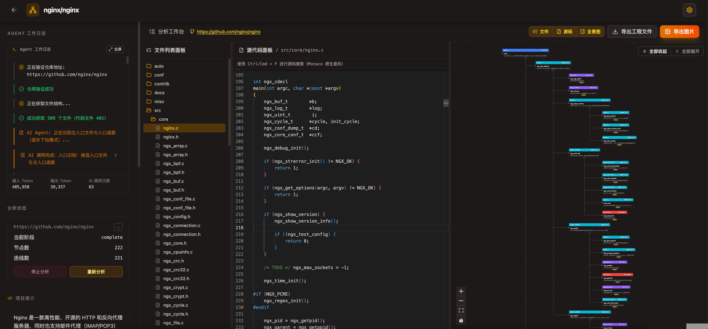
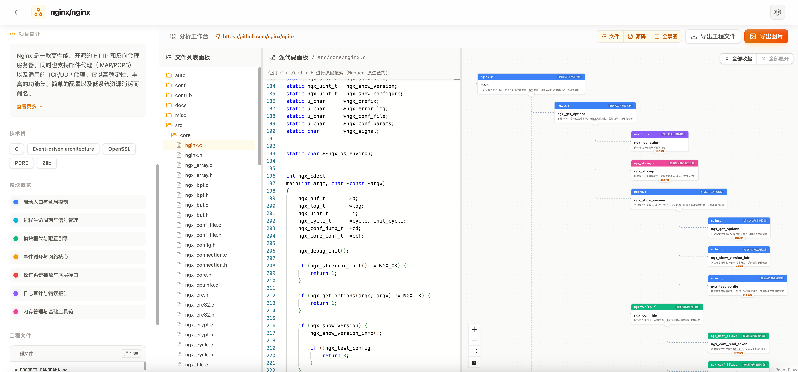

# Code Panorama

Code Panorama 是一个面向代码仓库和本地项目的 AI 全景分析工具。它会扫描项目文件、识别入口、逐级下钻关键函数调用链，并生成可交互的调用图、源码联动视图和可导出的项目全景文档。

开源地址：[https://github.com/xuanyuanzhifeng/code-panorama](https://github.com/xuanyuanzhifeng/code-panorama)





## 功能特性

- 支持分析 GitHub 仓库和本地项目目录
- 基于 AI 识别项目入口文件、入口函数和关键调用节点
- 逐层下钻函数调用链，构建交互式全景图
- 支持模块划分、源码查看、节点说明编辑和历史记录
- 支持导出 Markdown 全景报告和图谱图片
- 支持从已导出的全景文件重新导入分析结果

## 界面能力

- 首页支持 GitHub 仓库分析和本地目录分析两种模式
- 结果页提供文件树、源码面板、调用图、Agent 日志联动查看
- 设置页支持配置 GitHub Token、模型地址、模型名称、API Key 和分析参数
- 设置项默认保存在浏览器本地 `localStorage`，不会保存到服务端

## 适用场景

- 快速理解陌生代码库的整体结构
- 定位项目主入口与关键执行路径
- 生成便于交接、沉淀和汇报的项目全景文档
- 辅助阅读中大型工程中的核心调用链

## 技术栈

- Next.js 15
- React 19
- TypeScript
- Tailwind CSS
- Monaco Editor
- React Flow / XYFlow
- OpenAI 兼容接口
- better-sqlite3

## 本地运行

### 1. 环境要求

- Node.js 18+
- npm

### 2. 安装依赖

```bash
npm install
```

### 3. 配置环境变量

在项目根目录创建 `.env`，至少配置：

```bash
LLM_API_TYPE=chat
LLM_API_KEY=your_api_key
LLM_BASE_URL=https://api.openai.com/v1
LLM_MODEL=gemini3-flash-preview
```

其中 `LLM_API_TYPE` 支持：

- `chat`：使用 OpenAI 兼容的 `/v1/chat/completions`
- `responses`：使用 `/responses`

如需访问私有 GitHub 仓库，也可以在界面设置中填写 GitHub Token。

### 4. 启动开发环境

```bash
npm run dev
```

默认访问地址：

[http://localhost:3000](http://localhost:3000)

## 构建与启动

```bash
npm run build
npm run start
```

## 使用说明

### 分析 GitHub 仓库

1. 打开首页，选择 `GitHub 仓库`
2. 输入仓库地址
3. 如有需要，在设置页填写 GitHub Token 和模型配置
4. 点击开始分析

### 分析本地项目

1. 打开首页，选择 `本地目录`
2. 输入本机项目绝对路径，或使用目录选择器
3. 点击开始分析

说明：

- 本地目录分析依赖服务端直接访问本地文件系统
- 因此该功能仅适用于本地部署或服务端与项目目录位于同一台机器的场景
- 如果部署在远程服务器上，而你输入的是自己电脑上的路径，服务端无法访问该目录，分析会失败

## 部署注意事项

### 关于本地目录分析

本地目录分析不是浏览器直接读取本地文件，而是：

1. 前端把你输入的路径传给后端
2. 后端根据该路径读取文件系统
3. 后端返回文件树、源码内容和分析结果

这意味着：

- 本地运行时可正常分析你电脑上的项目
- 部署到远程服务器后，只能分析服务器本机可访问的路径
- 当前项目已在前后端增加提示：当路径在服务端不存在时，会提醒“本地分析仅限本地部署使用，当前无法使用”

### 关于设置保存

设置页中的模型配置、Token 和分析参数默认保存在浏览器本地，不会写入服务端数据库，也不会回写到服务器环境变量。

## 导出能力

- 导出 Markdown 全景文档
- 导出图谱图片
- 导入已导出的 Markdown/JSON 结果继续查看

## 项目结构

```text
app/                    Next.js App Router 页面与 API
app/api/                GitHub、本地文件、LLM、历史记录接口
src/App.tsx             主界面与交互逻辑
src/hooks/              分析逻辑与辅助 Hook
src/components/         图谱、输入框、日志、节点等 UI 组件
lib/                    文件系统、历史存储、模型调用等服务逻辑
```

## 未来方向

- 更稳定的入口识别与调用链定位
- 更多语言和框架支持
- 更精细的模块划分与图谱布局
- 更完善的部署模式和权限模型

## 开源说明

如果你打算基于这个项目继续开发，建议优先关注这些部分：

- [src/App.tsx](./src/App.tsx)
- [src/hooks/useGithubAgent.ts](./src/hooks/useGithubAgent.ts)
- [app/api](./app/api)
- [lib](./lib)

欢迎提 Issue 和 PR。

## 作者与社区

个人网站：[https://www.xuanyuancode.com](https://www.xuanyuancode.com)

欢迎关注微信公众号，获取项目更新和开发内容：


